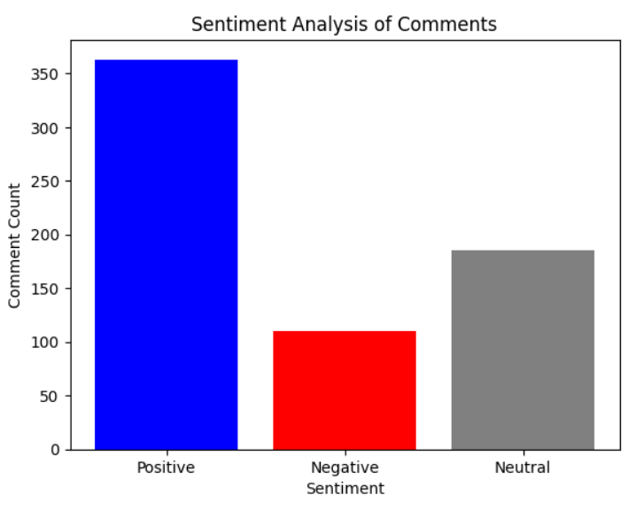

# 📊 YouTube Video Sentiment Analysis Extension

### 🌟 **What is it?**
The **YouTube Video Sentiment Analysis Extension** is a powerful browser extension that lets users analyze the sentiment of comments on any YouTube video. Leveraging IBM Watson Natural Language Understanding (NLU) and the YouTube Data API, this project provides insights into whether the comments on a video are **positive**, **negative**, or **neutral**. Results are displayed in a user-friendly format, including interactive **pie chart visualizations**.

---

## 🚀 **Features**

- 🎥 **Fetch Comments**: Uses the YouTube Data API to retrieve comments from a YouTube video.
- 🤖 **Sentiment Analysis**: Analyzes the sentiment of each comment using IBM Watson NLU.
- 📊 **Visualization**: Displays sentiment distribution with pie charts for better insights.
- 🖥️ **Simple Interface**: Easy-to-use browser extension for quick sentiment analysis.

---

## 🛠️ **Technologies Used**

- **Frontend**: HTML, CSS, JavaScript (for the extension interface).
- **Backend**: Flask (Python-based API).
- **APIs**:
  - YouTube Data API for fetching video comments.
  - IBM Watson NLU for sentiment analysis.
- **Visualization**: Matplotlib for creating pie charts.
- **Environment**: Jupyter Notebook for prototyping and development.

---

## 📥 **Installation**

### **Step 1: Clone the Repository**
```bash
# Clone this repository to your local machine
git clone https://github.com/your-username/youtube-sentiment-extension.git
```

### **Step 2: Set Up the Backend**
1. Navigate to the project directory:
   ```bash
   cd youtube-sentiment-extension
   ```
2. Install the required dependencies:
   ```bash
   pip install -r requirements.txt
   ```
3. Add your API keys:
   - Open `app.py` and replace the placeholders with your:
     - YouTube API Key
     - IBM Watson NLU API Key and URL

4. Run the Flask server:
   ```bash
   python app.py
   ```

### **Step 3: Load the Extension**
1. Open your browser and go to the extensions settings.
2. Enable **Developer Mode**.
3. Click on **Load unpacked extension** and select the `extension` folder from the repository.

---

## 🧪 **How to Use**

1. Open the browser extension by clicking its icon.
2. Paste the YouTube video URL into the input field.
3. Click the **Analyze** button.
4. View the sentiment analysis results, including the number of positive, negative, and neutral comments, along with a pie chart visualization.

---

## 📚 **File Structure**
```
youtube-sentiment-extension/
├── app.py                 # Flask backend for sentiment analysis
├── extension/             # Browser extension files
│   ├── manifest.json      # Extension configuration
│   ├── popup.html         # HTML for the extension popup
│   ├── popup.js           # JavaScript logic for the extension
│   └── styles.css         # Styling for the extension popup
├── requirements.txt       # Python dependencies
└── README.md              # Project documentation (this file)
```

---

## 📋 **Requirements**

- Python 3.7+
- Flask
- Flask-CORS
- Requests
- Matplotlib
- IBM Watson NLU API Key and URL
- YouTube Data API Key

---

## 🖼️ **Screenshots**

### Sentiment Analysis Results

---

## 🤝 **Contributing**
We welcome contributions to improve this project! Here’s how you can help:
1. Fork the repository.
2. Create a new branch for your feature (`git checkout -b feature-name`).
3. Commit your changes (`git commit -m 'Add feature'`).
4. Push to your branch (`git push origin feature-name`).
5. Open a Pull Request.


---

## ❤️ **Acknowledgments**

- IBM Watson for the Natural Language Understanding API.
- Google for the YouTube Data API.
- The open-source community for their amazing libraries and tools.

---

